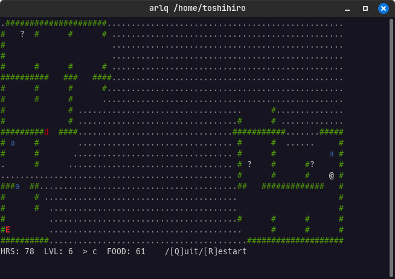

# ARLQ, another rogue-like quest game

ARLQ (Another Rogue-Like Quest) game created as an experiment in developing code and manuals with humans and ChatGPT.

* Code was generated by ChatGPT from a rough description of the game content and brushed up by humans working out the details.
  * However, many things were done by ChatGPT besides code generation, such as introducing algorithms (maze generation) and asking how to use the curses library.
  * Type hints are mostly generated by ChatGPT.
  * ChatGPT helped me with some ideas for new monsters.
* The manual (shown below) was intended to be generated by ChatGPT from the description of the code, but was given up halfway through, and the human explanation was finished by ChatGPT.
  * ChatGPT's contribution was a significant factor in the manual's rather informal tone.

## Game Description

* Game Objective: The goal of this game is to explore a dungeon with different passages each time and find the treasure chest hidden by the dragon!

* Player: You can move the player character, "@", using the arrow keys to go up, down, left, or right.

* Monsters: There are various monsters in the dungeon! For example, "a" is an Amoeba, not too strong but defeating it will level you up. "b" is a Bison, which gives you lots of food when defeated. There are many more monsters! However, monsters are initially shown as "?" but once you make contact, they'll be displayed as "a", "b", "c", etc., revealing their true identity.

* Fog System: In this game, only the areas you've walked through will be visible, thanks to the fog system. It works with auto-mapping, so once you visit an area, it remains fog-free.

* Combat: When you touch a monster, a battle ensues. If you fight a monster of the same or lower level, you can defeat it, gain a level, and acquire any items it has. But if you face a higher-level monster, you'll lose and respawn in a random location within the dungeon. Monsters generally don't move and wait for you to engage, so whether you fight or pass them by is up to you.

* Rare Types: Rare type monsters have amazing features compared to regular ones! For example, defeating the rare type "A" of "a" will level you up much faster. Defeating the rare type "B" of "b" will give you even more food than usual.

* Food System: Your food supply (hunger) decreases as you walk. If it reaches 0, you'll starve and it's game over, so be careful! Defeating "b" (Bison) will give you lots of food.

* Game End: The game ends when you obtain (touch) the dragon's treasure chest. Aim to be a treasure hunter!

For those curious, there's a more detailed monster description next! Feel free to discover it as you enjoy the game! Now, have a great time exploring the dungeon!

## Monster List

|Monster Display, Name | Description |
|---|---|
|a Amoeba|Weak enough for the player to defeat from the start. Good for leveling up.|
|b Bison|Second weakest. Gives lots of food. Hunt a Bison when you're hungry!|
|c Chimera|Fairly strong. Carries a sword that you can obtain when defeated. With the sword, your attack power triples in the next battle.|
|d Komodo Dragon|Strong. If defeated, provides a lot of food, but being poisoned, your attack power will be reduced to one-third in the next battle.|
|f Fairy|Not a foe. Follows you when you come in contact. Gives you a small blessing.|
|g Gorgon|A monster that petrifies you instantly just by making eye contact. Without a fairy companion, your body will be petrified for 48 hours! Be careful!|
|A Rare Amoeba|A rare Amoeba that boosts your level significantly!|
|B Rare Bison|So delicious that you'll probably eat much more than a regular Bison|
|C Rare Chimera|In addition to the sword, it possesses clairvoyance.|
|D Dragon|Strong. Defeating the Dragon reveals the treasure chest ("T") location. Even if you don't defeat it, you'll be able to recognize the chest.|
|E Elemental|Not a foe. Teleports the player to a random location in the dungeon. Offers extra services for high-level players.|

## License

The license for this code is BSD-2.

However, please note that the way the code generated by AI is treated depends on the laws in the country where you live, regardless of the license chosen by the developer (myself).
Also, please note that I have not directly copied and pasted any source code other than what ChatGPT has generated.

